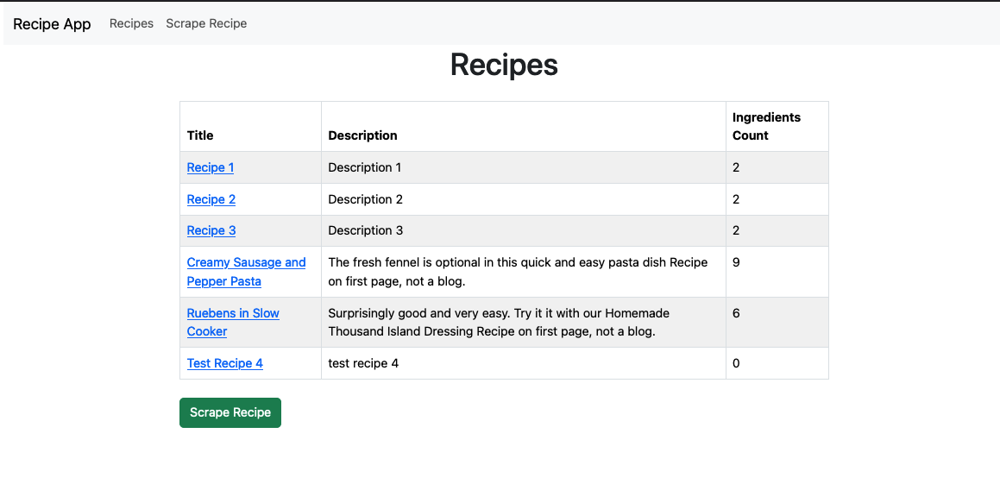
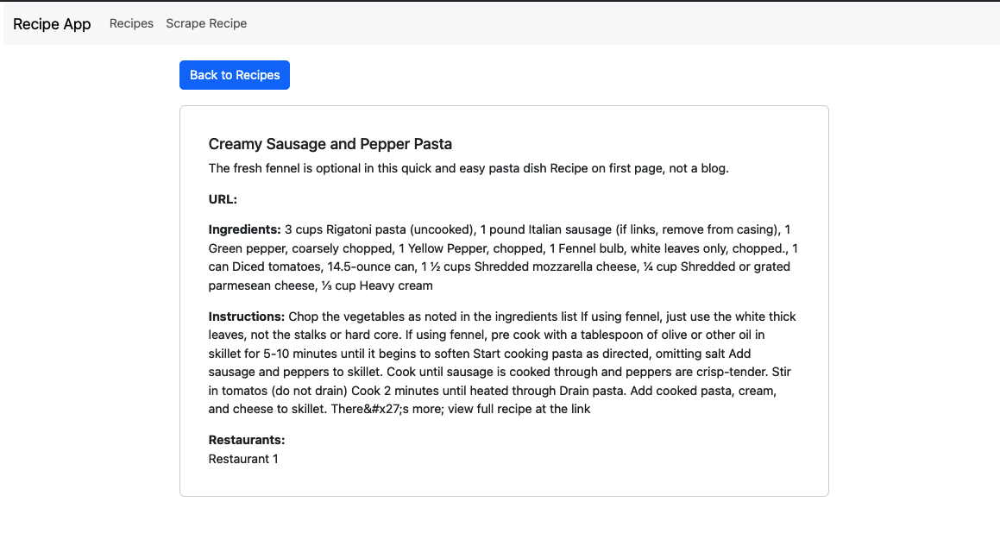
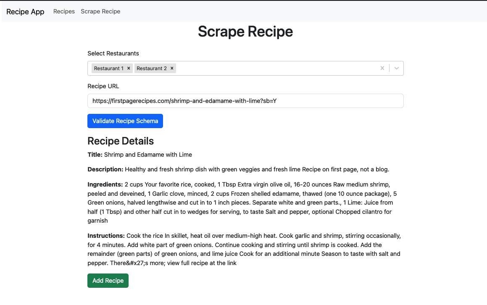
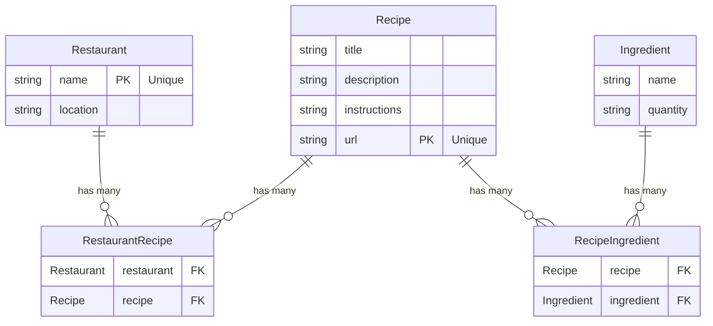

# Description

A Simple Web Application built with React + Django which allows users to view a set of registered recipes, and scrape recipe data from websites to add to the app.

# Tech Stack
- Docker
- React.js
- React-Bootstrap
- Django w/ DRF
- BeautifulSoup4

# Screenshots

Recipe List



Recipe Details



Recipe Scraping



# Setup

## Build + Deploy Frontend/Backend

-   Run the initial setup:
    `make docker_setup`
-   Run the migrations:
    `make docker_migrate`
-   Run the project:
    `make docker_up`

## Seed mock data

- run `docker compose run --rm backend bash` to open an interactive shell
- run `python manage.py seed_data` in the shell

## Create admin user

- run `docker compose run --rm backend bash` to open an interactive shell (if not already in shell)
- run `python manage.py createsuperuser` in the shell

## Access django admin

- Navigate to `localhost:8000/admin`
- Log in with superuser credentials

## Access frontend

- Navigate to `localhost:8000`

## Run Tests

- Run `make docker_test`

## Instructions
- To scrape a new recipe, navigate to the 'Scrape Recipe' tab
- Select restaurants, enter a url of a recipe website and click 'Validate Recipe Schema'
  * The scraping logic will look for  valid schema.org recipe schema
  * Example URLs: `https://firstpagerecipes.com/ruebens-in-slow-cooker?sb=Y`, `https://www.simplyrecipes.com/salisbury-ground-beef-recipe-8605396`
- The app will validate if the url contains a valid recipe schema and display the information. After reviewing, select 'Add Recipe'

# What is needed to make this production ready?
1. Add jwt user auth with a registration and login page
2. Add pagination to recipe list table view
3. Improve unit test coverage

# Feature improvements?
1. Allow the user to provide a list of urls for batch scraping jobs, and run a celery task which scrapes each url and stores the result
2. Add jwt user auth with a registration and login page
3. Improve the recipe + ingredient data model
  a. Create a separate table to store each instruction step, which contains instruciton text and order
  b. Store additional attributes from the schema.org recipe schema, such as recipeCategory, recipeCuisine, recipeYield, keywords, totalTime, images, etc
  c. For ingredients, store ingredient name, unit of measurement, and units
4. Add recipe search functionality
5. Add a restaurant registration form for new restaurants
6. Allow editing the restaurants of existing recipes
7. Improve admin panel interface to allow admins to enter all ingredient information without needing to create a separate Ingredient & RecipeIngredient record for each recipe ingredient


# GPT Prompts used?

I prompted GPT to assist in writing the code which parses attributes from the schema.org recipe schema for a given recipe url.

```
Using python and beautifulsoup, write logic to extract the following attributes from the js object inside of the <script type="application/ld_json"> element of a websites contents

Attributes:
- Ingredients
- Instructions
- Recipe Name
- Recipe Description

Here is an example object:

<script type="application/ld+json">
{
    "@context": "https://schema.org/",
    "@type": "Recipe",
    "name": "Shrimp and Edamame with Lime",
    "image": [
        "https://firstpagerecipes.com/static/assets/shrimp-and-edamame-with-lime/img/1x1/s1x1.jpg",
    ],

    "recipeIngredient": [
        "2 cups Your favorite rice, cooked",
        ...
    ],
    "recipeInstructions": [
        
            {
                "@type": "HowToStep",
                "text": "Cook the rice"
            },
            ...
    ]

}
</script>
```

# ER Diagram

